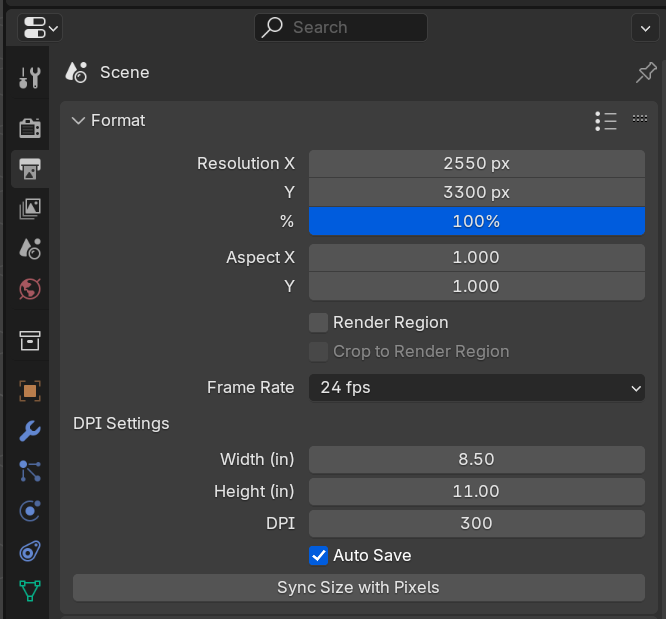

# Render DPI addon for Blender

This addon helps you convert physical dimensions (using inches and DPI) to pixel sizing and can save your file in the correct DPI.

Perfect if you do print work and need to export images at high resolutions, and don't feel like doing DPI math to convert your design's physical dimensions to pixels.

## ⬇️ Installation

1. [Download the plugin zip](https://github.com/whoisryosuke/blender-render-dpi/releases/download/v0.0.2/render_dpi-0.0.2.zip) from the releases page
1. Open Blender
1. Go to Edit > Preferences and go to the Addons tab on left.
1. Click install button.
1. Select the zip you downloaded.
1. You can confirm it's installed by searching for **"Render DPI"** and seeing if it's checked off

# How to use

1. Open the Output tab (the printer looking icon) in the Properties window.
1. Find the plugin under "DPI Settings" in the Format panel (usually first one).
1. Enter your image width and height in inches.
1. Set the DPI.
1. Press **"Sync Size with Pixels"** button. You should see the "Resolution X and Y" change pixel size.

> ⚠️ Note that **your image in Blender will still save as 72dpi unless you use the "auto save" feature.** You'll need to use a tool like Photoshop to convert it to 300dpi (using Image > Image Size). But using this addon - your image won't lose any quality since you'll have all the pixel density you need for the resolution change.

## Saving with DPI

Your image won't save with the proper DPI if you render and use `Image > Save Image`. Blender by default saves in 72dpi.

If you want to save your images with proper DPI, make sure the **"Auto Save"** checkbox is on.

Every time you render this will save images in the same folder as your Blender file in a folder called `/renders`. For example, if your Blender file is `E:/3D/project-name/the-project.blend` then the images will be in `E:/3D/project-name/renders`.

The file will be saved as the **same file type/extension as your Blender scene** (see: Output panel > File Format dropdown).

The images are named using the following naming convention:

```
[BLENDER_FILENAME][WIDTH][HEIGHT][DPI][DATETIME].[FILE_EXTENSION]
```

> If you're animating something, this will save twice (once in the animation folder, and once in the renders folder). The plugin have special conditions for animations, so it'll just save any render. I'd recommend turning turning auto save off if unless you need the DPI changes.

## Development

1. Install the plugin using the release ZIP.
1. Go to the plugin folder.
1. Delete the contents.
1. Clone the repo and copy the contents inside this folder
1. Edit, Save, Repeat.

> We have to install from the release ZIP because Blender won't recognize the `.wheels` files and install them if we install from a folder. This was the only workaround I've found.

## Publish

1. Bump version in `__init__.py`
1. Bump version in `blender_manifest.toml`
1. `blender --command extension build --output-dir dist`
1. Upload the new `.zip` file generated inside `/dist` folder to [GitHub Releases page](https://github.com/whoisryosuke/blender-render-dpi/releases/new).
1. Update README with new download link.

> On Windows? You can add `blender` to your command line by going to Start annd searching for "Edit Environment Variables for your account". Find the Variable "PATH" and edit it. Add the full path to where your `blender.exe` is located (e.g. `C:/Program Files/Blender/4.2/`).

### Dependencies

We basically have Python PIP "wheel" files that contain dependencies we need for this addon. The manifest installs them for us. Running the build command just zips up the folder with the version name attached - nothing fancy.

If you want to update the dependencies, run these commands and then update the `blender_manifest.toml` with any new `.whl` filenames:

```shell
pip download pillow --dest ./wheels --only-binary=:all: --python-version=3.11 --platform=macosx_11_0_arm64
pip download pillow --dest ./wheels --only-binary=:all: --python-version=3.11 --platform=manylinux_2_28_x86_64
pip download pillow --dest ./wheels --only-binary=:all: --python-version=3.11 --platform=win_amd64
```

## Acknowledgements

- [dpi_tool](https://github.com/AIGODLIKE/dpi_tool) _(sorry you got stuck in [Extensions limbo](https://extensions.blender.org/approval-queue/dpi-tool/) too)_
- [Blender PR: "Render: support pixel density in the render pipeline"](https://projects.blender.org/blender/blender/pulls/127831) _(supposed to merge into Blender eventually but they're too busy [arguing if it's even useful](https://projects.blender.org/blender/blender/pulls/127831#issuecomment-1309022))_
