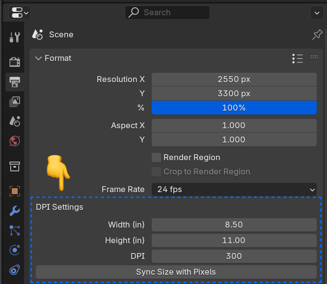

# Render DPI addon for Blender

This addon helps you convert physical dimensions (using inches and DPI) to pixel sizing.

Perfect if you do print work and need to export images at high resolutions, and don't feel like doing DPI math to convert your design's physical dimensions to pixels.

> ⚠️ Note that **your image in Blender will still save as 72dpi.** You'll need to use a tool like Photoshop to convert it to 300dpi (using Image > Image Size). But using this addon - your image won't lose any quality since you'll have all the pixel density you need for the resolution change.

## ⬇️ Installation

1. [Download the plugin zip](https://github.com/whoisryosuke/blender-render-dpi/releases/download/v0.0.1/render_dpi-0.0.1.zip) from the releases page
1. Open Blender
1. Go to Edit > Preferences and go to the Addons tab on left.
1. Click install button.
1. Select the zip you downloaded.
1. You can confirm it's installed by searching for **"Render DPI"** and seeing if it's checked off

# How to use

1. Open the Output tab (the printer looking icon) in the Properties window.
1. Find the plugin under "DPI Settings" in the Format panel (usually first one).
1. Enter your image width and height in inches.
1. Set the DPI.
1. Press **"Sync Size with Pixels"** button.

You should see the "Resolution X and Y" change pixel size.

## Development

1. Clone the repo: `git clone`
1. Install in Blender
1. Open the plugin code inside your Blender plugin folder
1. Edit, Save, Repeat.

## Publish

1. Bump version in `__init__.py`
1. Bump version in `blender_manifest.toml`
1. `blender --command extension build --output-dir dist`
1. Upload the new `.zip` file generated inside `/dist` folder to Blender addon marketplace and [GitHub Releases page](https://github.com/whoisryosuke/blender-render-dpi/releases/new).

## Acknowledgements

- [dpi_tool](https://github.com/AIGODLIKE/dpi_tool) _(sorry you got stuck in [Extensions limbo](https://extensions.blender.org/approval-queue/dpi-tool/) too)_
- [Blender PR: "Render: support pixel density in the render pipeline"](https://projects.blender.org/blender/blender/pulls/127831) _(supposed to merge into Blender eventually but they're too busy [arguing if it's even useful](https://projects.blender.org/blender/blender/pulls/127831#issuecomment-1309022))_
